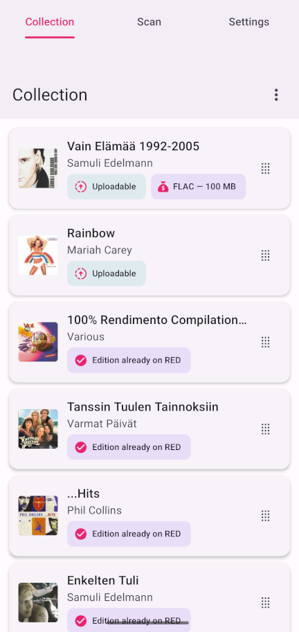

# Scout


A quick and easy way to manage potential uploads. Scan barcodes to look up physical releases (CDs, vinyls, etc) on Discogs, and check availability and request status on RED.



## Features

- **Barcode scanning** - Use your camera to scan EAN/UPC barcodes on vinyl records and CDs
- **Discogs lookup** - Automatically fetches release info (artist, title, cover art) from the Discogs database
- **RED integration** - Check whether a scanned release is uploaded, has open requests, or has other editions on Redacted
- **Collection management** - Browse, reorder (drag-and-drop), multi-select, and delete releases
- **Theming** - Light, dark, and system-default appearance modes

## Releases

See the [releases](https://github.com/frog-tools/Scout/releases) page of this project to get the latest version.

## Configuration

In the app's Settings tab:

- **Discogs API** - Add a [personal access token](https://www.discogs.com/settings/developers) to increase the API rate limit
- **RED API** - Add an API key (generated in your RED user settings, must have Torrents and Requests permissions) to enable upload/request checking

## Install on Android

Allow untrusted sources and install using an `.apk` file.

## Install on iOS

Install [SideStore](https://sidestore.io) and add [frog tools](sidestore://source?url=https://frogtools.app/sidestore) as a source.

## Building

### Prerequisites

- [Node.js](https://nodejs.org/) (v18+)
- [Expo CLI](https://docs.expo.dev/get-started/installation/)
- For Android builds: [Android SDK](https://developer.android.com/studio) with platform 35+ and build-tools 35+
- For iOS builds: Xcode (macOS only)

### Quick-start

Install dependencies:

```bash
npm install
```

Start the Expo development server:

```bash
npm start
```

Then press `a` to open on a connected Android device/emulator, or `i` for iOS simulator.

### Building an APK

Generate the native Android project and build a release APK:

```bash
export ANDROID_HOME=~/Android/Sdk
npx expo prebuild --platform android --clean
cd android
./gradlew assembleRelease
```

The APK will be at `android/app/build/outputs/apk/release/app-release.apk`.

### Building for iOS

Requires macOS with Xcode installed. Generate the native iOS project and build:

```bash
npx expo prebuild --platform ios --clean
cd ios
pod install
xcodebuild -workspace Scout.xcworkspace -scheme Scout -configuration Release -sdk iphoneos -derivedDataPath build
```

The `.app` bundle will be at `build/Build/Products/Release-iphoneos/Scout.app`.

To install on a connected device via the command line:

```bash
xcrun devicectl device install app --device <device-id> build/Build/Products/Release-iphoneos/Scout.app
```

You can find your device ID with `xcrun devicectl list devices`.

## Contributing

Bug reports and feature requests are always welcome! Create them on the project's [issues page](https://github.com/frog-tools/Scout/issues). Please also feel free to open a [Pull Request](https://github.com/frog-tools/Scout/pulls) with changes.
